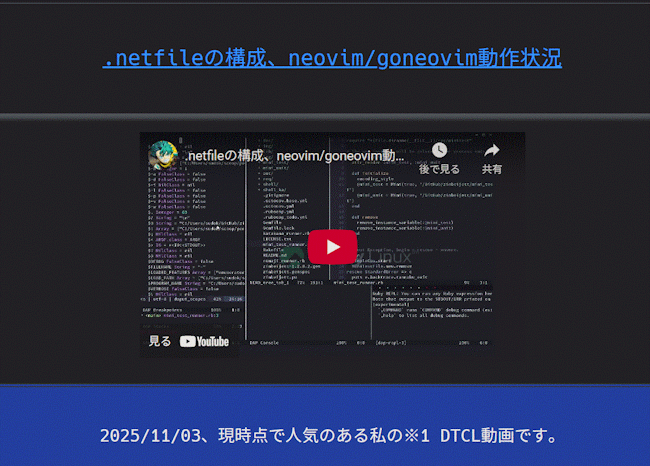

   

   
  <h1>
<a href="https://youtu.be/fap4OGIeaW4?si=yBbFnSp0Pk_4cXBc">Newworld</a> Project.
</h1>
  
    
  <h3>
※ このシステムは、接続元のIPアドレスをログに書き出します。
</h3>
  <h3>
不正アクセスなどを検知するセキュリティ対策のため、ご了承ください。
</h3>
   

